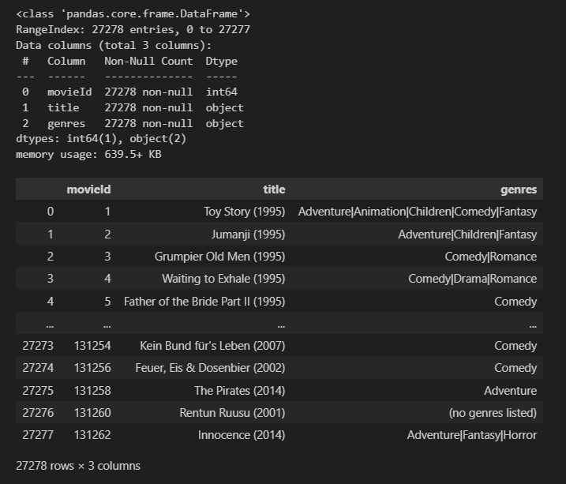
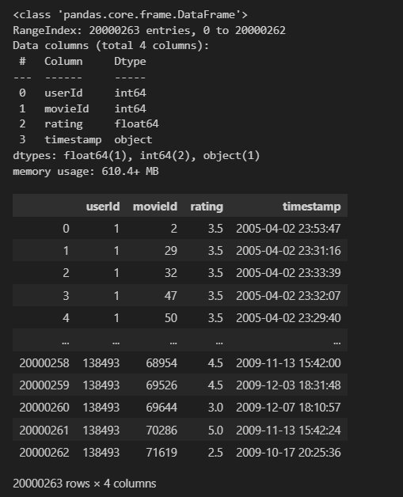
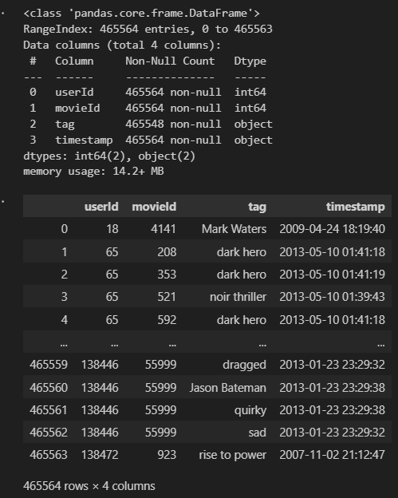
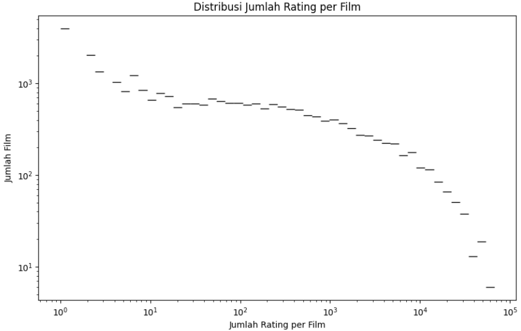
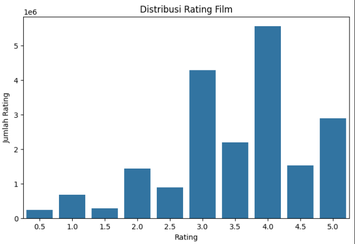
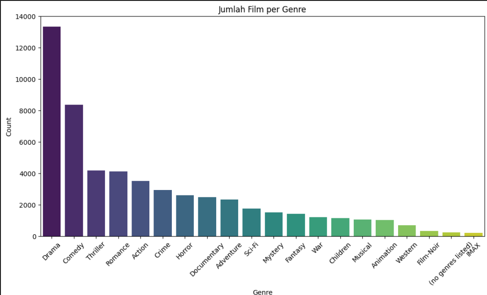
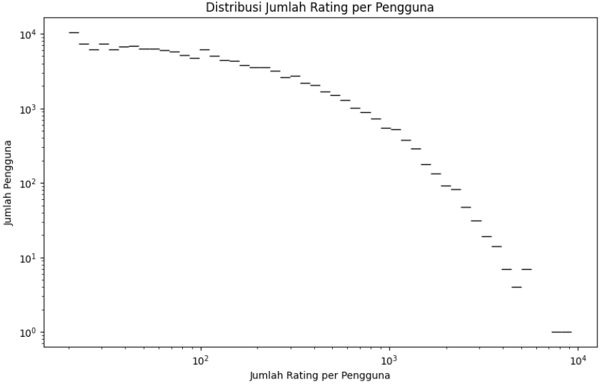
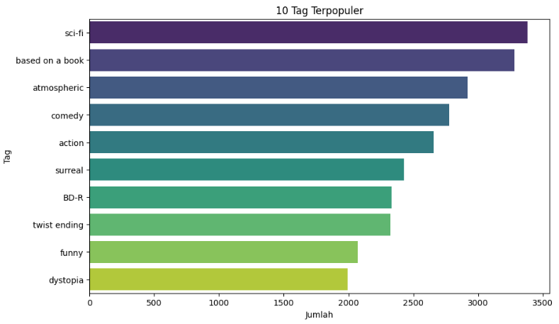
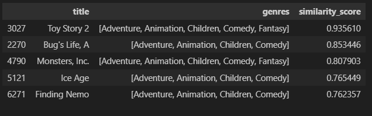
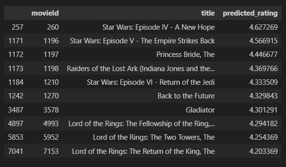

# Laporan Proyek Machine Learning - Ajwa Nabawiya

## Project Overview

Pertumbuhan pesat layanan streaming film seperti Netflix, Amazon Prime Video, dan Disney+ telah mengubah cara masyarakat mengakses hiburan. Jutaan film dan serial tersedia dalam satu platform, menciptakan tantangan baru bagi pengguna dalam menemukan konten yang sesuai dengan preferensi mereka. Dalam konteks ini, **sistem rekomendasi** menjadi komponen penting untuk menyaring informasi dan memberikan saran tayangan yang relevan. Tanpa sistem ini, pengguna akan menghabiskan banyak waktu dalam proses pencarian, yang berdampak negatif terhadap pengalaman pengguna secara keseluruhan.

Dua pendekatan utama dalam pengembangan sistem rekomendasi yang paling umum digunakan adalah **Collaborative Filtering (CF)** dan **Content-Based Filtering (CBF)**. Collaborative Filtering bekerja dengan memanfaatkan interaksi historis antar pengguna dan item, seperti penilaian (rating) atau histori tontonan, untuk memprediksi preferensi pengguna baru berdasarkan kemiripan perilaku dengan pengguna lain [1]. Teknik ini dikenal efektif dalam mengungkap pola preferensi tersembunyi yang tidak tergantung pada atribut konten. Sementara itu, Content-Based Filtering merekomendasikan item berdasarkan fitur atau atribut konten itu sendiri, seperti genre, sutradara, aktor, dan sinopsis. Sistem ini akan mencocokkan karakteristik film dengan profil pengguna berdasarkan histori preferensinya, memungkinkan hasil yang lebih personal [2].

Meskipun kedua pendekatan tersebut telah terbukti efektif, masing-masing memiliki keterbatasan. CF cenderung mengalami masalah pada skenario **cold-start**, yaitu ketika pengguna atau item baru belum memiliki cukup interaksi yang tercatat dalam sistem. Di sisi lain, CBF memiliki keterbatasan dalam hal **diversitas rekomendasi**, karena hanya menyarankan item dengan fitur serupa, sehingga rekomendasi bisa terasa monoton bagi pengguna. Oleh karena itu, memahami keunggulan dan kelemahan masing-masing metode secara terpisah menjadi penting untuk pengembangan sistem rekomendasi yang lebih adaptif dan responsif terhadap kebutuhan pengguna.

Proyek ini bertujuan untuk mengembangkan dua model sistem rekomendasi film: satu berbasis Collaborative Filtering dan satu berbasis Content-Based Filtering, menggunakan framework **TensorFlow** untuk pemodelan. Evaluasi kinerja dilakukan dengan menggunakan metrik **Precision\@K** dan **Recall\@K**, untuk mengukur sejauh mana sistem mampu memberikan rekomendasi yang relevan dan mencakup preferensi pengguna secara luas. Proyek ini penting karena dapat memberikan wawasan praktis mengenai performa masing-masing metode dalam konteks dunia nyata, sekaligus sebagai dasar bagi pengembangan sistem rekomendasi yang lebih akurat dan efektif di masa depan.


## Business Understanding

Untuk membangun sistem rekomendasi yang efektif, kita perlu terlebih dahulu mengidentifikasi dan merumuskan pernyataan masalah utama yang dihadapi oleh pengguna dan platform streaming. Pernyataan masalah ini akan menjadi dasar dalam menentukan tujuan serta pendekatan solusi yang akan diterapkan.

### Problem Statements

- Pengguna platform streaming film sering mengalami kesulitan dalam menemukan film yang sesuai dengan preferensi dan selera pribadi mereka akibat jumlah konten yang sangat banyak dan beragam.
- Sistem rekomendasi yang ada saat ini belum mampu memberikan rekomendasi yang cukup akurat dan personal untuk setiap pengguna, terutama dalam menangani pengguna baru (cold-start problem) dan keberagaman konten.
- Perlu adanya sistem rekomendasi yang dapat meningkatkan keterlibatan pengguna dan memaksimalkan kepuasan pengguna dengan menyediakan rekomendasi film yang relevan dan bervariasi.

### Goals

- Mengembangkan sistem rekomendasi film yang mampu memberikan saran film yang sesuai dengan preferensi individu pengguna secara akurat dan relevan.
- Meningkatkan kemampuan sistem dalam menangani kasus cold-start untuk pengguna baru maupun item baru agar rekomendasi tetap berkualitas.
- Meningkatkan keterlibatan dan kepuasan pengguna melalui rekomendasi yang bervariasi dan sesuai dengan minat mereka.

### Solution statements

Untuk mencapai tujuan tersebut, proyek ini akan menggunakan dua pendekatan sistem rekomendasi yang saling melengkapi, yaitu:

- Content-Based Filtering (CBF): Pendekatan ini menggunakan fitur atau atribut dari film, seperti genre, sutradara, aktor, dan deskripsi film, untuk memberikan rekomendasi berdasarkan kesamaan dengan film yang sudah disukai pengguna sebelumnya. CBF efektif dalam mengatasi cold-start item karena tidak bergantung pada data interaksi pengguna, namun terbatas pada variasi fitur yang tersedia.
- Collaborative Filtering (CF): Pendekatan ini memanfaatkan pola interaksi dan preferensi pengguna lain yang memiliki kemiripan dengan pengguna target untuk merekomendasikan film. CF sangat efektif dalam menemukan pola preferensi tersembunyi dan memberikan rekomendasi yang bervariasi, namun sering menghadapi kendala cold-start pada pengguna baru yang minim interaksi.


## Data Understanding
Proyek ini menggunakan dataset MovieLens 20M, sebuah dataset yang banyak digunakan untuk membangun dan mengevaluasi sistem rekomendasi film. Dataset ini tersedia secara publik dan dapat diakses melalui tautan https://www.kaggle.com/datasets/grouplens/movielens-20m-dataset?select=tag.csv. Dataset ini terdiri dari lebih dari 20 juta rating yang diberikan oleh pengguna terhadap film, serta dilengkapi dengan metadata film seperti genre, judul, dan tag yang diberikan oleh pengguna. Dataset utama yang digunakan dalam proyek ini terdiri dari tiga bagian utama:

1. movies.csv

    Terdiri dari 27.278 baris data, berisi informasi mengenai film yang tersedia dalam sistem.

    

    - movieId: ID unik yang merepresentasikan setiap film.
    - title: Judul film beserta tahun rilis dalam format string.
    - genres: Genre film, dipisahkan oleh tanda "|", misalnya "Adventure|Animation|Children".

    Dataset pertama, movies.csv, berisi sebanyak 27.278 entri yang merepresentasikan berbagai film yang tersedia dalam sistem. Setiap film diidentifikasi oleh ID unik (movieId), disertai dengan judul film (title) yang mencakup nama dan tahun rilis, serta informasi genre (genres) yang dipisahkan oleh tanda |, contohnya seperti "Adventure|Animation|Children". Dataset ini bersih dan tidak memiliki missing value pada seluruh kolom.

2. ratings.csv

    Merupakan komponen utama dalam membangun sistem rekomendasi berbasis interaksi pengguna, berisi 20.000.263 entri rating.

    

    - userId: ID unik untuk masing-masing pengguna.
    - movieId: ID film yang dirating oleh pengguna.
    - rating: Nilai rating yang diberikan pengguna terhadap film, dalam skala 0.5 hingga 5.0.
    - timestamp: Waktu saat rating diberikan dalam format UNIX timestamp.

    Dataset kedua, ratings.csv, merupakan komponen utama dalam membangun sistem rekomendasi berbasis interaksi pengguna. Terdiri dari 20.000.263 entri, data ini mencakup informasi mengenai ID pengguna (userId), ID film (movieId), nilai rating (rating) yang diberikan pengguna terhadap film dalam skala 0.5 hingga 5.0, serta waktu (timestamp) dalam format UNIX timestamp. Seluruh kolom utama tidak memiliki nilai kosong, menjadikan dataset ini layak untuk digunakan dalam proses pelatihan model rekomendasi.
    
3. tags.csv

    Berisi data anotasi/tag yang diberikan pengguna untuk film tertentu, dengan total 465.564 entri.

    

    - userId: ID pengguna yang memberikan tag.
    - movieId: ID film yang diberi tag.
    - tag: Tag berupa kata kunci atau deskripsi pendek yang menggambarkan film.
    - timestamp: Waktu ketika tag diberikan.

    Dataset ketiga, tags.csv, memuat 465.564 anotasi/tag yang diberikan pengguna terhadap film tertentu. Informasi yang tersedia meliputi userId, movieId, tag berupa deskripsi singkat atau kata kunci yang menggambarkan film, dan timestamp sebagai penanda waktu saat tag diberikan. Meskipun sebagian kecil entri pada kolom tag terdapat nilai kosong, proporsinya sangat kecil dibanding total data sehingga tidak berdampak signifikan terhadap keseluruhan analisis.

Ketiga dataset ini memberikan fondasi yang kuat untuk mengembangkan sistem rekomendasi berbasis Collaborative Filtering dan Content-Based Filtering, dengan cakupan data yang luas dan kondisi data yang relatif bersih.

### Eksplorasi Awal dan Analisis Data

#### Distribusi Jumlah Rating per Film


Visualisasi distribusi jumlah rating per film menunjukkan bahwa sebagian besar film dalam dataset hanya menerima sedikit rating, sementara hanya sedikit film yang memperoleh rating dalam jumlah besar. Pola ini mencerminkan karakteristik distribusi long-tail, di mana sejumlah kecil film sangat populer dan menarik banyak perhatian pengguna, sedangkan sebagian besar film cenderung kurang dikenal atau jarang ditonton. Dengan menggunakan skala logaritmik pada kedua sumbu, visualisasi ini memperjelas perbedaan ekstrem dalam jumlah rating antar film. Hal ini penting untuk diperhatikan dalam pengembangan sistem rekomendasi, karena bias terhadap film-film populer dapat mengurangi keragaman rekomendasi yang dihasilkan.

#### Distribusi Rating Film


Visualisasi distribusi rating film menunjukkan bahwa sebagian besar pengguna cenderung memberikan rating yang tinggi terhadap film yang mereka tonton. Puncak distribusi terlihat pada rating 4.0 dan 3.5, yang menunjukkan bahwa banyak pengguna menilai film dengan skor di atas rata-rata. Sebaliknya, rating rendah seperti 0.5 dan 1.0 hanya diberikan pada sebagian kecil film, yang mengindikasikan bahwa penilaian negatif lebih jarang terjadi. Pola distribusi ini mencerminkan adanya bias positif dalam perilaku pengguna, yang penting untuk diperhatikan dalam pengembangan sistem rekomendasi agar tidak terlalu mengandalkan skor tinggi sebagai indikator kualitas tanpa mempertimbangkan konteks lainnya.

#### Jumlah Film per Genre


Berdasarkan visualisasi jumlah film per genre, terlihat bahwa genre *Drama* merupakan yang paling dominan dengan jumlah film terbanyak, jauh melampaui genre lainnya. Di posisi berikutnya terdapat genre *Comedy*, *Thriller*, dan *Romance* yang juga memiliki jumlah film yang cukup signifikan. Sementara itu, genre seperti *Action*, *Crime*, *Horror*, dan *Documentary* berada pada kategori menengah dalam hal jumlah film. Di sisi lain, terdapat genre-genre dengan jumlah film yang relatif sedikit seperti *Musical*, *Animation*, dan *Western*. Bahkan, beberapa kategori seperti *IMAX* dan *no genres listed* memiliki jumlah film yang sangat kecil, kemungkinan besar mewakili genre khusus atau film tanpa kategori genre yang jelas. Ketimpangan distribusi ini menunjukkan bahwa dataset yang digunakan memiliki konsentrasi film yang tinggi pada genre-genre tertentu, terutama Drama dan Comedy. Hal ini dapat memengaruhi hasil analisis maupun sistem rekomendasi yang dibangun, karena model cenderung bias terhadap genre-genre populer dan kurang mampu merepresentasikan genre-genre minoritas. Oleh karena itu, penting untuk mempertimbangkan metode penyeimbangan data atau pengelompokan ulang genre agar hasil analisis lebih adil dan menyeluruh.

#### Jumlah Rating per Pengguna


Berdasarkan visualisasi distribusi jumlah rating per pengguna, terlihat bahwa mayoritas pengguna memberikan sedikit rating, sedangkan hanya sebagian kecil pengguna yang sangat aktif memberikan rating dalam jumlah besar. Grafik yang menggunakan skala logaritmik pada kedua sumbu menunjukkan pola distribusi yang sangat miring ke kanan (right-skewed), menandakan adanya ketimpangan dalam aktivitas pengguna. Hal ini umum terjadi pada data interaksi pengguna, di mana sebagian besar pengguna hanya berkontribusi dalam jumlah kecil, sedangkan sebagian kecil lainnya sangat aktif. Pola seperti ini penting untuk diperhatikan dalam pembangunan sistem rekomendasi, karena pengguna yang sangat aktif cenderung lebih berpengaruh dalam pembentukan model. Oleh karena itu, dalam beberapa kasus, mungkin diperlukan pendekatan khusus untuk menangani ketimpangan ini, misalnya dengan memberikan bobot atau filter pada pengguna berdasarkan tingkat aktivitas mereka, agar model tidak terlalu dipengaruhi oleh kelompok pengguna tertentu.

#### Visualisasi 10 Tag Terpopuler


Grafik di atas menampilkan 10 tag yang paling sering muncul dalam dataset, ditampilkan dalam bentuk bar chart horizontal. Tag yang paling dominan adalah *"sci-fi"*, diikuti oleh *"based on a book"* dan *"atmospheric"*, yang menunjukkan bahwa tema fiksi ilmiah, adaptasi dari buku, serta suasana atmosferik sering digunakan untuk menggambarkan film dalam koleksi data ini. Selain itu, tag seperti *"comedy"* dan *"action"* mencerminkan genre populer yang banyak diminati. Kehadiran tag seperti *"surreal"*, *"twist ending"*, dan *"dystopia"* menunjukkan ketertarikan pengguna terhadap elemen cerita yang tidak biasa dan menggugah. Tag *"BD-R"* kemungkinan merujuk pada format distribusi media, sedangkan *"funny"* memperkuat keberadaan konten humor dalam film. Secara keseluruhan, visualisasi ini memberikan gambaran awal mengenai preferensi umum atau karakteristik dominan dari film dalam dataset berdasarkan frekuensi tag yang digunakan.


## Data Preparation
Pada tahap data preparation, beberapa teknik penting diterapkan secara berurutan untuk memastikan data siap digunakan dalam pemodelan prediksi deret waktu. Berikut ini adalah langkah-langkah yang dilakukan beserta alasan pemilihannya:

1. Menghapus kolom timestamp pada dataset ratings dan tag

    Kolom timestamp yang berisi waktu ketika rating atau tag diberikan dihapus karena tidak relevan untuk analisis rekomendasi berbasis rating dan tag itu sendiri. Hal ini dilakukan untuk mengurangi dimensi data dan fokus pada informasi yang memang dibutuhkan (userId, movieId, rating, dan tag). Ini juga mempercepat proses komputasi.


    ```python
     ratings.drop(columns='timestamp', inplace=True)
     tag.drop(columns='timestamp', inplace=True)

2. Menghapus baris dengan nilai tag kosong (missing value) pada dataset tag

    Baris-baris yang memiliki nilai tag kosong dihilangkan agar data tag yang digunakan valid dan bermakna karena tag kosong tidak memberikan informasi apapun dan dapat mengganggu proses analisis serta model pembelajaran.


    ```python
    tag = tag.dropna(subset=['tag'])

3. Memisahkan tahun rilis film dari judul film pada dataset movie

    Menggunakan ekspresi reguler, tahun rilis film yang ada dalam tanda kurung () dipisahkan ke kolom baru year. Judul film kemudian dibersihkan dari informasi tahun tersebut. Tahun rilis merupakan fitur penting yang dapat digunakan untuk analisis tren atau rekomendasi berbasis waktu, sementara judul film menjadi lebih bersih dan standar.

    ```python
    movie['year'] = movie['title'].str.extract(r'\((\d{4})\)')
    movie['title'] = movie['title'].str.replace(r'\s*\(\d{4}\)', '', regex=True)

4. Memecah kolom genres menjadi list genre

    Setiap genre film dipisah menjadi list genre yang lebih mudah untuk diproses (misal untuk content-based filtering). Jika genre tidak tersedia, maka diberikan list kosong. Format list memudahkan pemrosesan fitur genre sebagai kategori dan perhitungan similarity antar film berdasarkan genre.


    ```python
    movie['genres'] = movie['genres'].apply(lambda x: x.split('|') if x != '(no genres listed)' else [])
    movie

5. One-Hot Encoding Genre
    
    Pertama, dilakukan pengumpulan seluruh genre unik yang ada pada data film, sehingga terbentuk himpunan genre (genre_set). Selanjutnya, untuk setiap genre dalam himpunan tersebut dibuat kolom baru yang berisi nilai biner, yaitu 1 jika film tersebut memiliki genre tersebut dan 0 jika tidak. Dengan demikian, setiap film direpresentasikan menggunakan fitur biner berdasarkan genre, misalnya kolom genre_Comedy bernilai 1 jika film termasuk genre Comedy. Tahap akhir adalah memilih semua kolom genre yang sudah dibuat sebagai fitur utama untuk digunakan dalam perhitungan kemiripan antar film.

    ```python
    genre_set = set(g for sublist in movie['genres'] for g in sublist)
    for genre in genre_set:
        movie[f'genre_{genre}'] = movie['genres'].apply(lambda x: int(genre in x))

    genre_features = movie[[f'genre_{g}' for g in genre_set]]

6. Penggabungan Tag per Film

    Mengelompokkan data tag berdasarkan movieId dan menggabungkan semua tag menjadi satu string panjang untuk setiap film dengan tujuan untuk mengubah kumpulan tag per film menjadi satu dokumen teks, sehingga bisa digabung dengan genre dan digunakan sebagai input fitur tekstual.

    ```python
    tag_text = tag.groupby('movieId')['tag'].apply(lambda x: ' '.join(x)).reset_index()

7. Menggabungkan Tag ke Dataset Utama

    Melakukan merge antara movie dan tag_text berdasarkan movieId. Jika ada film yang tidak memiliki tag, diisi dengan string kosong (''). Tujuannya adalah untuk menyatukan informasi tag dengan data film. Tanpa ini, film tidak memiliki fitur teks gabungan untuk dianalisis dalam CBF.

    ```python
    movie_with_tag = movie.merge(tag_text, on='movieId', how='left')
    movie_with_tag['tag'] = movie_with_tag['tag'].fillna('')  

8. Membuat Kolom Fitur gabungan Genre dan Tag

    Membuat kolom baru combined_features yang menggabungkan genre (yang diubah ke string) dan tag untuk setiap film.Tujuannya adalah untuk menyatukan semua informasi konten menjadi satu teks deskriptif yang digunakan untuk menghitung kemiripan antar film.

    ```python
   movie_with_tag['combined_features'] = movie_with_tag.apply(lambda x: ' '.join(['genres']) + ' ' + x['tag'], axis=1)

9. Mereset Index

    Melakukan reset pada indeks dataframe untuk memastikan bahwa indeks sesuai urutan baris dan tidak menimbulkan error saat digunakan sebagai referensi dalam cosine similarity.

    ```python
    movie_with_tag = movie_with_tag.reset_index(drop=True)

9. Vectorisasi dengan TF-IDF

    TF-IDF digunakan untuk mengubah combined_features menjadi vektor numerik, menangkap pentingnya setiap kata unik sambil menghilangkan kata umum (stop words).

    ```python
    tfidf = TfidfVectorizer(stop_words='english')
    tfidf_matrix = tfidf.fit_transform(movie_with_tag['combined_features'])

10. Sampling dan Mapping User-Movie ID

    Dataset ratings sangat besar (20 juta+ baris), jadi untuk efisiensi komputasi saya memilih 10.000 user unik secara acak dari dataset rating besar agar proses training lebih cepat dan memori tidak terlalu berat.

    ```python
    rating_sample = ratings[ratings['userId'] <= 10000].copy()
    user_sample = np.random.choice(ratings['userId'].unique(), size=10000, replace=False)
    rating_sample = ratings[ratings['userId'].isin(user_sample)].copy()

11. Membuat Mapping ID User dan Movie ke Index Integer

    Karena model embedding memerlukan input dalam bentuk indeks numerik, maka langkah pertama yang dilakukan adalah membuat dua dictionary, yaitu user_id_mapping dan movie_id_mapping. Dictionary user_id_mapping digunakan untuk mengubah userId asli menjadi indeks numerik berurutan (misalnya 0, 1, 2, dan seterusnya), begitu juga dengan movie_id_mapping yang mengubah movieId menjadi indeks numerik. Setelah mapping ini dibuat, dua kolom baru yaitu user dan movie ditambahkan ke dalam dataframe rating_sample untuk menyimpan hasil konversi tersebut. Representasi numerik ini penting agar data dapat dimasukkan ke dalam embedding layer pada model, yang hanya menerima input berupa indeks integer. Dengan begitu, proses pelatihan model dapat berjalan dengan lebih efisien dan sesuai dengan struktur yang dibutuhkan oleh TensorFlow.

    ```python 
    user_id_mapping = {id_: i for i, id_ in enumerate(rating_sample['userId'].unique())}
    movie_id_mapping = {id_: i for i, id_ in enumerate(rating_sample['movieId'].unique())}

    rating_sample['user'] = rating_sample['userId'].map(user_id_mapping)
    rating_sample['movie'] = rating_sample['movieId'].map(movie_id_mapping)


## Modeling
Dalam proyek ini, dua pendekatan sistem rekomendasi digunakan untuk menyelesaikan permasalahan, yaitu Content-Based Filtering (CBF) dan Collaborative Filtering (CF). Keduanya dikembangkan untuk menyajikan top-N rekomendasi yang dipersonalisasi sesuai karakteristik film dan perilaku pengguna. Kelebihan dari Content-Based Filtering (CBF) adalah tidak tergantung pada rating pengguna lain, cocok untuk cold-start user. Penjelasan rekomendasi mudah dipahami karena berbasis konten. Sedangkan kekurangannya adalah kurang menangkap preferensi pengguna secara personal; hanya membandingkan kemiripan antar film. Film yang tidak memiliki cukup deskripsi (genre/tag kosong) akan diabaikan. Kelebihan Collaborative Filtering (CF) adalah dapat menangkap preferensi personal pengguna, merekomendasikan film yang belum ditonton tapi mungkin disukai berdasarkan interaksi. Sedangkan kekurangannya adalah tidak  bisa merekomendasikan film baru yang belum dirating oleh siapapun (cold-start item). Butuh data interaksi yang cukup banyak agar akurat.

### Content-Based Filtering (CBF)
CBF menyarankan film kepada pengguna berdasarkan kemiripan konten antar film, terutama dari informasi genre dan tag.


1. Perhitungan Cosine Similarity

    Menghitung kemiripan antar semua pasangan film berdasarkan vektor TF-IDF menggunakan cosine similarity.Tujuannya adalah untuk menentukan film mana yang paling mirip secara konten, yang nantinya akan direkomendasikan ke pengguna.

    ```python
    cosine_sim = cosine_similarity(tfidf_matrix, tfidf_matrix)

2. Fungsi Rekomendasi

    Fungsi recommend_movies merupakan implementasi sederhana dari metode Content-Based Filtering (CBF) dalam sistem rekomendasi film. Cara kerjanya dimulai dengan menerima input berupa judul film sebagai acuan, kemudian mencari posisi film tersebut di dataset. Selanjutnya, fungsi menghitung kemiripan antara film acuan dengan semua film lain menggunakan matriks cosine similarity yang sudah dihitung sebelumnya berdasarkan fitur film seperti genre atau deskripsi. Film-film tersebut kemudian diurutkan berdasarkan tingkat kemiripan tertinggi, dengan mengabaikan film acuan sendiri, dan memilih sejumlah film teratas sesuai parameter yang diinginkan. Fungsi ini mengembalikan daftar film yang paling mirip beserta nilai skor kemiripannya. Secara arsitektur, pendekatan ini mengandalkan representasi fitur film dalam bentuk vektor dan pengukuran cosine similarity untuk menentukan seberapa mirip dua film. Metode ini tidak bergantung pada data interaksi pengguna, melainkan hanya menggunakan informasi konten film untuk memberikan rekomendasi yang relevan dan personalisasi berbasis kesamaan konten.


     ```python 
     def recommend_movies(title, top_n=5):
        # Cari index film berdasarkan title
        idx = movie_with_tag[movie_with_tag['title'] == title].index[0]
    
        # Hitung similarity semua film terhadap film ini
        sim_scores = list(enumerate(cosine_sim[idx]))
    
        # Urutkan berdasarkan similarity tertinggi, kecuali film itu sendiri
        sim_scores = sorted(sim_scores, key=lambda x: x[1], reverse=True)[1:top_n+1]
    
        # Ambil indeks dan skor similarity
        movie_indices = [i[0] for i in sim_scores]
        scores = [i[1] for i in sim_scores]
    
        # Ambil data film rekomendasi
        results = movie_with_tag.iloc[movie_indices][['title', 'genres']].copy()
        results['similarity_score'] = scores
    
        return results

3. Hasil dan Contoh Output

    Fungsi merekomendasikan beberapa film dengan skor kemiripan tertinggi (misal 5 film teratas), kecuali film input sendiri yang diabaikan. Hasil rekomendasi ini berupa daftar judul film, genre, dan nilai similarity yang menunjukkan seberapa dekat genre film tersebut dengan film input.

    

    Data hasil rekomendasi menunjukkan daftar film yang memiliki kemiripan genre tertinggi dengan film yang dijadikan acuan, beserta skor kemiripannya. Misalnya, film Antz, Toy Story 2, dan beberapa lainnya memiliki genre yang sama persis seperti Adventure, Animation, Children, Comedy, dan Fantasy, sehingga nilai similarity_score-nya mencapai 1.0 yang berarti sangat mirip atau identik dalam hal genre. Skor ini membantu mengidentifikasi film-film yang sangat relevan untuk direkomendasikan berdasarkan preferensi genre pengguna.


### Collaborative Filtering (CF)
Pendekatan ini mempelajari pola interaksi pengguna dan memprediksi preferensi berdasarkan perilaku pengguna lain yang serupa.

1. Arsitektur Model RecommenderNet

    Model ini menggunakan pendekatan matrix factorization dengan embedding berdimensi 50 untuk merepresentasikan user dan movie. Setiap user dan movie diubah menjadi vektor melalui embedding layer, lalu ditambahkan bias masing-masing untuk menangkap kecenderungan rating umum. Prediksi rating dihitung melalui dot product antara embedding user dan movie ditambah bias, sehingga menghasilkan skor akhir sebagai rating yang diperkirakan.

    ```python
    class RecommenderNet(Model):
    def __init__(self, num_users, num_movies, embedding_size=50):
        super(RecommenderNet, self).__init__()
        # Embedding layer untuk user, ukuran embedding 50 dimensi
        self.user_embedding = layers.Embedding(num_users, embedding_size,
                                               embeddings_regularizer=regularizers.l2(1e-6))
        # Embedding layer untuk movie
        self.movie_embedding = layers.Embedding(num_movies, embedding_size,
                                                embeddings_regularizer=regularizers.l2(1e-6))
        # Bias user (untuk menangkap kecenderungan rating user secara umum)
        self.user_bias = layers.Embedding(num_users, 1)
        # Bias movie (untuk menangkap rating rata-rata movie)
        self.movie_bias = layers.Embedding(num_movies, 1)

    def call(self, inputs):
        # Ambil embedding user dan movie berdasarkan indeks input
        user_vector = self.user_embedding(inputs[:, 0])
        movie_vector = self.movie_embedding(inputs[:, 1])
        user_bias = self.user_bias(inputs[:, 0])
        movie_bias = self.movie_bias(inputs[:, 1])
        
        # Hitung dot product antara embedding user dan movie
        dot = tf.reduce_sum(user_vector * movie_vector, axis=1, keepdims=True)
        
        # Tambahkan bias user dan movie ke hasil dot product
        return tf.squeeze(dot + user_bias + movie_bias, axis=1)

2. Persiapan Data Training

    Data input (x_train) berbentuk pasangan (user_index, movie_index) dengan dimensi (jumlah_data, 2), sedangkan target (y_train) berisi rating asli. Format ini disesuaikan agar kompatibel dengan struktur input model.

3. Kompilasi dan Training Model

    Model menggunakan embedding size 50 untuk merepresentasikan user dan movie secara laten. Optimizer: Adam. Loss function: Mean Squared Error (MSE) karena tugas ini adalah regresi. Model dilatih dengan batch size 512 selama 5 epoch, dengan 10% data sebagai validation set.

    ```python
    model = RecommenderNet(num_users=len(user_id_mapping), num_movies=len(movie_id_mapping), embedding_size=50)
    model.compile(optimizer='adam', loss='mse')
    model.fit(x_train, y_train, batch_size=512, epochs=5, validation_split=0.1)

4. Fungsi Rekomendasi

    Fungsi recommend_movies merupakan implementasi dari pendekatan Collaborative Filtering berbasis model, di mana sistem rekomendasi menggunakan model machine learning (seperti neural network) untuk memprediksi preferensi pengguna terhadap film yang belum ditonton. Cara kerja fungsi ini dimulai dengan mengubah user_id menjadi indeks numerik melalui user_id_mapping, lalu membuat kombinasi semua pasangan antara pengguna tersebut dengan seluruh film yang tersedia. Kombinasi ini digunakan sebagai input ke model untuk menghasilkan prediksi rating. Dari hasil prediksi tersebut, film dengan skor tertinggi dipilih sebagai rekomendasi, lalu dicocokkan kembali dengan judul film aslinya. Arsitektur ini memungkinkan sistem untuk memberikan rekomendasi yang bersifat personal, karena model telah mempelajari pola interaksi pengguna terhadap berbagai film. Pendekatan ini sangat efektif dalam menangkap preferensi kompleks, namun bergantung pada ketersediaan data historis dan bisa mengalami kendala ketika menghadapi pengguna atau film baru yang belum pernah muncul dalam data pelatihan.
    
    ```python
    def recommend_movies(model, user_id, user_id_mapping, movie_id_mapping, movie_df, top_n=10):
    user_idx = user_id_mapping[user_id]
    all_movie_indices = np.array(list(movie_id_mapping.values()))
    
    user_array = np.array([user_idx] * len(all_movie_indices))
    input_array = np.vstack([user_array, all_movie_indices]).T
    
    preds = model.predict(input_array)
    top_indices = preds.argsort()[-top_n:][::-1]
    
    recommended_movie_ids = [list(movie_id_mapping.keys())[i] for i in top_indices]
    recommended_movies = movie_df[movie_df['movieId'].isin(recommended_movie_ids)][['movieId', 'title']]
    recommended_movies = recommended_movies.assign(predicted_rating=preds[top_indices])
    
    return recommended_movies.sort_values(by='predicted_rating', ascending=False)

6. Hasil dan Contoh Output

    Langkah ini dimulai dengan memilih seorang pengguna secara acak, dalam hal ini menggunakan user pertama yang tersedia dari hasil pemetaan (user_id_mapping). Selanjutnya, fungsi rekomendasi dipanggil untuk pengguna tersebut guna menghasilkan daftar film yang paling mungkin disukai berdasarkan hasil prediksi rating dari model. Akhirnya, ditampilkan 10 film teratas yang direkomendasikan, diurutkan berdasarkan nilai rating prediksi tertinggi ke terendah.

    

    Daftar ini menunjukkan bahwa model dapat mengenali film-film populer dan yang berpotensi disukai oleh pengguna tersebut berdasarkan pola interaksi rating sebelumnya. Rekomendasi ini sangat berguna dalam membantu pengguna menemukan film baru yang sesuai preferensinya dan meningkatkan pengalaman penggunaan sistem rekomendasi.

## Evaluation

Sistem rekomendasi film ini menggunakan metrik Precision@K dan Recall@K untuk mengukur seberapa relevan item yang direkomendasikan terhadap preferensi pengguna. Precision@K menghitung proporsi item yang relevan dari K rekomendasi teratas, sedangkan Recall@K mengukur sejauh mana sistem berhasil menangkap seluruh item yang relevan. 

1. Precision@K

    Precision@K digunakan untuk mengukur ketepatan dari sistem rekomendasi, yaitu seberapa banyak item yang relevan dari K item yang direkomendasikan. Rumusnya adalah jumlah item relevan dalam top-K dibagi dengan K. Metrik ini penting ketika tujuan utama sistem adalah memberikan rekomendasi yang akurat dan sesuai dengan preferensi pengguna. Semakin tinggi nilai precision, semakin tepat saran yang diberikan oleh model.

2. Recall@K

    Recall@K mengukur sejauh mana sistem berhasil menemukan seluruh item yang relevan bagi pengguna. Rumusnya adalah jumlah item relevan dalam top-K dibagi dengan total jumlah item relevan yang sebenarnya. Metrik ini berguna untuk mengevaluasi cakupan sistem dalam menjaring item yang disukai pengguna. Nilai recall yang tinggi menunjukkan bahwa sistem tidak melewatkan banyak item penting, meskipun tidak semua rekomendasi tepat sasaran.

### Evaluasi Content-Based Filtering (CBF)

Hasil evaluasi model rekomendasi berbasis content-based filtering menunjukkan nilai Precision@5 sebesar 0.1091 dan Recall@5 sebesar 0.0062. Artinya, dari lima film yang direkomendasikan kepada pengguna, sekitar 11% di antaranya memang relevan dan sesuai dengan preferensi pengguna. Namun, nilai recall yang relatif rendah mengindikasikan bahwa model hanya mampu merekomendasikan kurang dari 1% dari keseluruhan film yang sebenarnya disukai oleh pengguna dalam daftar favorit mereka. Hal ini wajar mengingat model merekomendasikan sejumlah kecil item (top 5) dari koleksi film yang sangat banyak, sehingga sulit untuk mencakup semua preferensi pengguna. 

| Metrik        | Nilai   |
|---------------|---------|
| Precision@5   | 0.1091  |
| Recall@5      | 0.0062  | 

### Evaluasi Collaborative Filtering (CF)

Hasil evaluasi model rekomendasi berbasis collaborative filtering menunjukkan Precision@5 sebesar 0.6000 dan Recall@5 sebesar 0.0207. Artinya, dari lima film yang direkomendasikan, sekitar 60% adalah film yang relevan dan sesuai dengan preferensi pengguna, yang mengindikasikan tingkat akurasi rekomendasi yang cukup tinggi. Namun, nilai recall yang relatif rendah menunjukkan bahwa sistem hanya berhasil merekomendasikan sekitar 2% dari keseluruhan film yang disukai pengguna, sehingga masih banyak film relevan yang belum terjangkau oleh rekomendasi. Hal ini dapat terjadi karena rekomendasi dibatasi hanya pada top 5 film, sementara preferensi pengguna mungkin lebih luas. Meskipun demikian, hasil ini menunjukkan bahwa collaborative filtering cukup efektif dalam menyediakan rekomendasi berkualitas meskipun cakupan recall-nya masih bisa ditingkatkan.

| Metrik        | Nilai   |
|---------------|---------|
| Precision@5   | 0.6000  |
| Recall@5      | 0.0207  |


### Kesimpulan

Dari hasil evaluasi sistem rekomendasi yang menggunakan dua metode berbeda, yaitu content-based filtering (CBF) dan collaborative filtering (CF), terlihat perbedaan yang cukup signifikan pada metrik Precision@5 dan Recall@5. Collaborative filtering menunjukkan Precision@5 yang lebih tinggi, yaitu 0.6000, dibandingkan dengan CBF yang hanya mencapai 0.1091. Hal ini menandakan bahwa rekomendasi dari CF lebih akurat dalam menampilkan item yang relevan di antara lima rekomendasi teratas. Namun, nilai Recall@5 pada CF juga relatif rendah (0.0207), serupa dengan CBF (0.0062), yang berarti kedua metode masih memiliki keterbatasan dalam menjangkau seluruh preferensi pengguna secara luas.

Dengan kata lain, collaborative filtering mampu menghasilkan rekomendasi yang lebih tepat sasaran meskipun cakupan rekomendasinya masih terbatas. Sementara itu, content-based filtering memberikan rekomendasi yang lebih bervariasi tetapi kurang tepat jika dilihat dari tingkat presisinya. 


## Referensi 

[1] B. Sarwar, G. Karypis, J. Konstan, and J. Riedl, “Item-based collaborative filtering recommendation algorithms,” Proceedings of the 10th International Conference on World Wide Web, 2001. [Online]. Available: https://dl.acm.org/doi/10.1145/371920.372071

[2] P. Lops, M. De Gemmis, and G. Semeraro, “Content-based recommender systems: State of the art and trends,” in Recommender Systems Handbook, Springer, 2011, pp. 73–105. [Online]. Available: https://link.springer.com/chapter/10.1007/978-0-387-85820-3_3